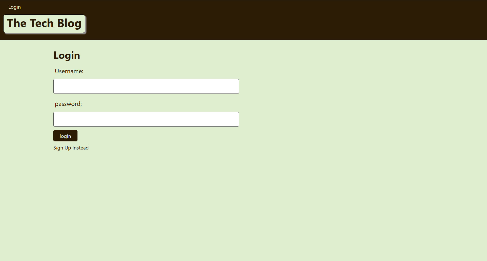
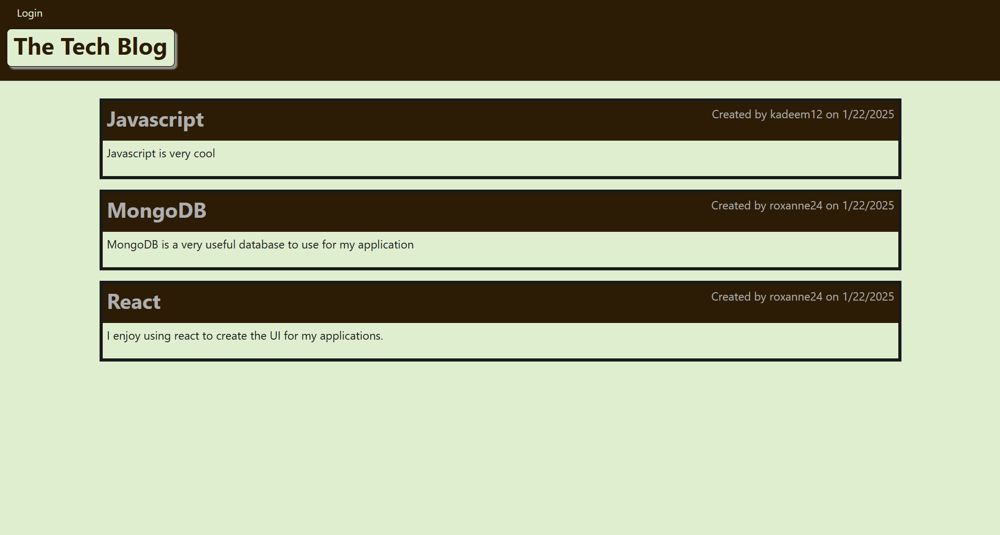
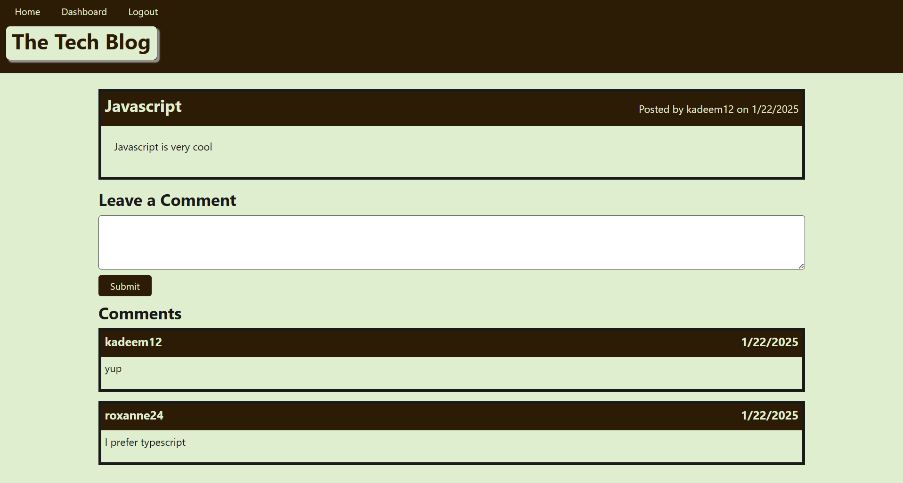
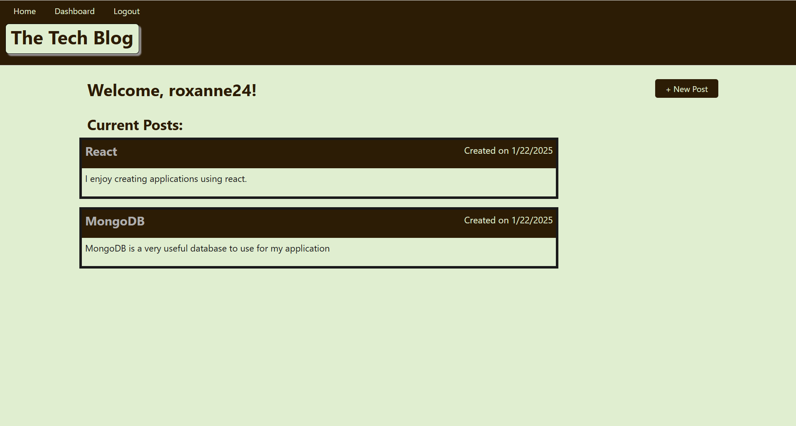
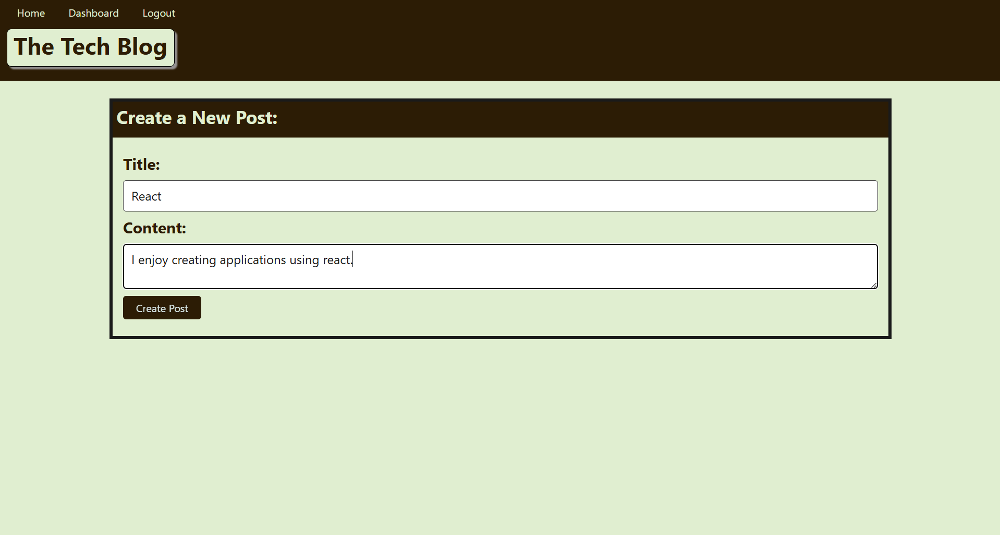
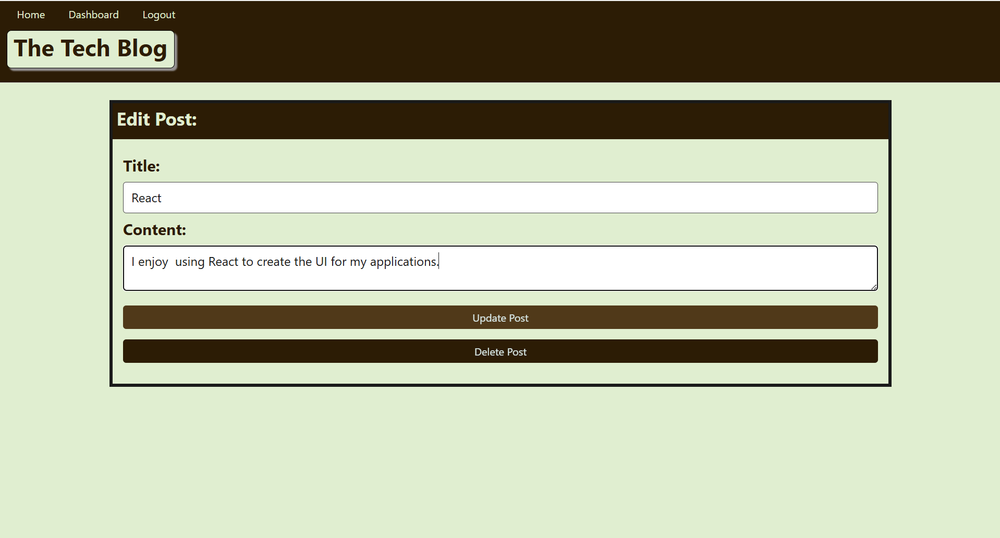

# Tech Blog

## Description

This project is a tech blog application designed to provide a platform for users to engage with the tech community. Users can view posts by others, leave comments, create their own posts, and have full control over managing their content with features to edit, update, and delete posts.

The application utilizes Handlebars.js as its templating engine to deliver a dynamic and interactive user interface. User authentication is efficiently managed through the express-session npm package, providing a secure and tailored experience. For database management, Sequelize serves as the ORM, simplifying data interactions and operations.

## Table of Contents

- [Installation](#installation)
- [Usage](#usage)
- [Credits](#credits)
- [License](#license)

## Installation

Use "npm i" to download the Express, PG, DOTENV, and Sequelize libraries.

## Usage

<a href="https://techblog-o842.onrender.com">Deployed Site</a> 

## Credits

<a href="https://www.npmjs.com/package/express-handlebars">Express-Handlebars</a> 

<a href="https://gist.github.com/lukas-h/2a5d00690736b4c3a7ba">License Page</a> 

## License

